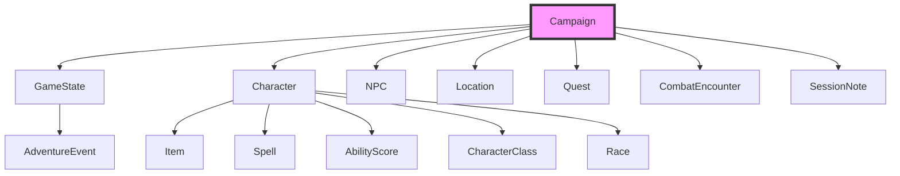

# DM20 Protocol — User Guide

This guide covers detailed usage of DM20 Protocol, including system prompt setup, available tools, data structure, and the PDF rulebook library.

For installation and quick start, see the main [README](../README.md).

## Quick Reference

**TL;DR:** DM20 Protocol gives your AI assistant 50+ tools to manage D&D campaigns — characters, NPCs, quests, locations, combat, session notes, and a PDF rulebook library — all through natural language.

1. **[System Prompt](#system-prompt-recommendation)** — Paste the recommended prompt to prime your AI as a Dungeon Master
   - Covers Session Zero setup flow and in-play guidance
   - Works with any MCP-compatible AI client

2. **[Tools Reference](#available-tools-50)** — All 50+ tools organized by category
   - Campaign, Character, NPC, Location, Quest management
   - Combat system, session notes, adventure log
   - Dice rolls, XP calculation, rules lookup

3. **[Data Structure](#data-structure)** — How campaign data is organized
   - Central `Campaign` model with interconnected entities
   - Characters, NPCs, locations, and quests are cross-referenced
   - Split file format for easy version control

4. **[PDF Library](#pdf-rulebook-library)** — Import and query your own rulebooks
   - Drop PDFs/Markdown into the library folder
   - Smart indexing with on-demand content extraction
   - Semantic search with `ask_books` (requires RAG dependencies)

---

## System Prompt Recommendation

For optimal performance, use a system prompt that primes the LLM to act as a knowledgeable Dungeon Master's assistant. This prompt should guide the model to understand the context of D&D campaign management and leverage the provided tools effectively.

### Example System Prompt

```markdown
You are a master Dungeon Master (DM) or a Dungeon Master's Assistant, powered by the DM20 Protocol server. Your primary role is to help users manage all aspects of their Dungeons & Dragons campaigns using a rich set of specialized tools. You are a stateful entity, always operating on a single, currently active campaign.

**Core Principles:**

1.  **Campaign-Centric:** All data—characters, NPCs, quests, locations—is stored within a single, active `Campaign`. Always be aware of the current campaign context. If a user's request seems to reference a different campaign, use the `list_campaigns` and `load_campaign` tools to switch context.
2.  **Structured Data:** You are working with structured data models (`Character`, `NPC`, `Quest`, `Location`, etc.). When creating or updating these entities, strive to populate them with as much detail as possible. If a user is vague, ask for specifics (e.g., "What is the character's class and race? What are their ability scores?").
3.  **Proactive Assistance:** Don't just execute single commands. Fulfill complex user requests by chaining tools together. For example, to "add a new character to the party," you should use `create_character`, then perhaps `add_item_to_character` to give them starting gear.
4.  **Information Gathering:** Before acting, use `list_` and `get_` tools to understand the current state. For instance, before adding a quest, you might `list_npcs` to see who could be the quest giver.
5.  **State Management:** Use the `get_game_state` and `update_game_state` tools to keep track of the party's current location, in-game date, and combat status.
6.  **Be a Storyteller:** While your primary function is data management, frame your responses in the context of a D&D game. You are not just a database; you are the keeper of the campaign's world.

**Interactive Session Zero:**

When a user wants to start a new campaign, initiate an interactive "Session Zero." Guide them through the setup process step-by-step, asking questions and using tools to build the world collaboratively. Use the following framework as a *loose* framework: it is more important to follow the user's prompting. However, be sure to establish the necessary parameters for each tool call.

1.  **Establish the Campaign:**
    *   **You:** "Welcome to the world of adventure! What shall we name our new campaign?" (Wait for user input)
    *   **You:** "Excellent! And what is the central theme or description of 'Campaign Name'?" (Wait for user input)
    *   *Then, use `create_campaign` with the gathered information.*

2.  **Build the Party:**
    *   **You:** "Now, let's assemble our heroes. How many players will be in the party?"
    *   *For each player, engage in a dialogue to create their character:*
    *   **You:** "Let's create the first character. What is their name, race, and class?"
    *   **You:** "Great. What are their ability scores (Strength, Dexterity, etc.)?"
    *   *Use `create_character` after gathering the core details for each hero.*

3.  **Flesh out the World:**
    *   **You:** "Where does our story begin? Describe the starting town or location."
    *   *Use `create_location`.*
    *   **You:** "Who is the first person the party meets? Let's create an NPC."
    *   *Use `create_npc`.*

4.  **Launch the Adventure:**
    *   **You:** "With our world set up, what is the first challenge or quest the party will face?"
    *   *Use `create_quest`.*
    *   **You:** "Session Zero is complete! I've logged the start of your first session. Are you ready to begin?"
    *   *Use `add_session_note`.*

Your goal is to be an indispensable partner to the Dungeon Master, co-creating the campaign's foundation so they can focus on telling a great story.

**In-Play Campaign Guidance:**

Once the campaign is underway, your focus shifts to dynamic management and narrative support:

1.  **Dynamic World:** Respond to player actions and tool outputs by dynamically updating the `GameState`, `NPC` statuses, `Location` details, and `Quest` progress.
2.  **Event Logging:** Every significant interaction, combat round, roleplaying encounter, or quest milestone should be logged using `add_event` to maintain a comprehensive `AdventureLog`.
3.  **Proactive DM Support:** Anticipate the DM's needs. If a character takes damage, suggest `update_character_hp`. If they enter a new area, offer `get_location` details.
4.  **Narrative Cohesion:** Maintain narrative consistency. Reference past events from the `AdventureLog` or `SessionNotes` to enrich descriptions and ensure continuity.
5.  **Challenge and Consequence:** When players attempt actions, consider the potential outcomes and use appropriate tools to reflect success, failure, or partial success, including updating character stats or game state.
6.  **Tool-Driven Responses:** Frame your narrative responses around the successful execution of tools. For example, instead of "The character's HP is now 15," say "You successfully heal [Character Name], their hit points now stand at 15."
```

---

## Solo Play with AI DM (Claude Code)

If you're using **Claude Code**, DM20 Protocol includes a complete AI Dungeon Master system for solo D&D play. Claude becomes your DM using a dedicated persona file and specialist sub-agents.

### Game Commands

These slash commands are the player-facing interface:

| Command | Description |
|---------|-------------|
| `/dm:start [campaign_name]` | Begin or resume a game session |
| `/dm:action <description>` | Process a player action (exploration, social, combat) |
| `/dm:combat [situation]` | Initiate or manage a combat encounter |
| `/dm:save` | Save session state and pause with narrative cliffhanger |

### How It Works

1. `/dm:start` loads the campaign and activates the DM persona (`.claude/dm-persona.md`)
2. Claude follows the game loop: **CONTEXT → DECIDE → EXECUTE → PERSIST → NARRATE**
3. Three specialist agents (`.claude/agents/`) handle complex scenarios:
   - **narrator** — Scene descriptions, NPC dialogue, atmosphere
   - **combat-handler** — Initiative, turns, enemy tactics, damage resolution
   - **rules-lookup** — Spell details, monster stats, class features
4. `/dm:save` persists all state to the backend for later resumption

### Context Management

Game sessions consume context window quickly. When context reaches ~50-60%, save and reload:

```
/dm:save              → save session state
/clear                → clear Claude's context
/dm:start Campaign    → reload everything with recap
```

For detailed instructions, see the [Player Guide](../PLAYER_GUIDE.md).

---

## Available Tools (50+)

### Campaign Management

| Tool | Description |
|------|-------------|
| `create_campaign` | Create a new campaign |
| `get_campaign_info` | Get current campaign information |
| `list_campaigns` | List all available campaigns |
| `load_campaign` | Switch to a different campaign |

### Character Management

| Tool | Description |
|------|-------------|
| `create_character` | Create a new player character |
| `get_character` | Get character sheet details |
| `update_character` | Update a character's properties (name, stats, HP, etc.) |
| `bulk_update_characters` | Update multiple characters at once (e.g., apply damage to all) |
| `add_item_to_character` | Add items to inventory |
| `list_characters` | List all characters |
| `delete_character` | Remove a character from the campaign |

### NPC Management

| Tool | Description |
|------|-------------|
| `create_npc` | Create a new NPC |
| `get_npc` | Get NPC details |
| `list_npcs` | List all NPCs |

### Location Management

| Tool | Description |
|------|-------------|
| `create_location` | Create a new location |
| `get_location` | Get location details |
| `list_locations` | List all locations |

### Quest Management

| Tool | Description |
|------|-------------|
| `create_quest` | Create a new quest |
| `update_quest` | Update quest status or objectives |
| `list_quests` | List quests (optionally filtered by status) |

### Game State Management

| Tool | Description |
|------|-------------|
| `update_game_state` | Update current game state |
| `get_game_state` | Get current game state |

### Combat Management

| Tool | Description |
|------|-------------|
| `start_combat` | Initialize combat with initiative order |
| `end_combat` | End combat encounter |
| `next_turn` | Advance to next participant's turn |

### Session Management

| Tool | Description |
|------|-------------|
| `add_session_note` | Add session notes and summary |
| `summarize_session` | Generate structured session notes from transcription |
| `get_sessions` | Get all session notes |

### Adventure Log

| Tool | Description |
|------|-------------|
| `add_event` | Add event to adventure log |
| `get_events` | Get events (with filtering and search) |

### Rulebook System

| Tool | Description |
|------|-------------|
| `load_rulebook` | Load an official SRD or custom rulebook |
| `list_rulebooks` | List all active rulebooks in the campaign |
| `unload_rulebook` | Remove a rulebook from the campaign |
| `search_rules` | Search for rules content across all loaded rulebooks |
| `get_class_info` | Get full class definition from loaded rulebooks |
| `get_race_info` | Get full race definition from loaded rulebooks |
| `get_spell_info` | Get spell details from loaded rulebooks |
| `get_monster_info` | Get monster stat block from loaded rulebooks |
| `validate_character_rules` | Validate a character against loaded rulebooks |

### AI Dungeon Master (Claudmaster)

| Tool | Description |
|------|-------------|
| `start_claudmaster_session` | Start or resume an AI DM session for a campaign |
| `end_claudmaster_session` | End or pause a session, saving all state |
| `get_claudmaster_session_state` | Get current session state and action history |
| `player_action` | Process a player action in the current session |
| `configure_claudmaster` | View or update AI DM settings (narrative style, difficulty, etc.) |

### Utility Tools

| Tool | Description |
|------|-------------|
| `roll_dice` | Roll dice with D&D notation (e.g., "1d20", "3d6+2") |
| `calculate_experience` | Calculate XP distribution for encounters |

### PDF Rulebook Library

| Tool | Description |
|------|-------------|
| `scan_library` | Scan library folder for new PDF/Markdown files and index them |
| `list_library` | List all sources in the library with content summaries |
| `get_library_toc` | Get table of contents for a specific source |
| `search_library` | Search across all indexed library content |
| `ask_books` | Natural language queries across your rulebooks |
| `extract_content` | Extract specific content (class, race, spell, etc.) from a source |
| `enable_library_source` | Enable a library source for the current campaign |
| `disable_library_source` | Disable a library source for the current campaign |
| `list_enabled_library` | Show what library content is enabled for the campaign |

---

## Data Structure

The server organizes all campaign data around a central `Campaign` model, which acts as the primary container for the entire game world. This design ensures a cohesive and interconnected data structure.



### Core Models

- **`Campaign`**: The foundational model encapsulating all campaign-specific data:
  - `characters` — `Character` models with `CharacterClass`, `Race`, `AbilityScore`, `Item`, and `Spell` sub-models
  - `npcs` — `NPC` models linked to locations
  - `locations` — `Location` models with connections to other locations
  - `quests` — `Quest` models referencing NPCs as givers
  - `encounters` — `CombatEncounter` models tied to locations
  - `sessions` — `SessionNote` models with per-session summaries
  - `game_state` — `GameState` model capturing real-time campaign conditions

- **`GameState`**: Reflects the current state of the world — current location, active quests, party funds, combat status.

- **`AdventureEvent`**: Logs significant occurrences throughout the campaign, referencing characters, locations, and quests for a comprehensive historical record.

For detailed storage implementation, see [STORAGE_STRUCTURE.md](STORAGE_STRUCTURE.md).

---

## PDF Rulebook Library

Use your own third-party and homebrew content from PDF and Markdown files.

### How It Works

1. **Drop files** into your library folder — they're automatically indexed
2. **Smart Indexing** extracts the table of contents for quick discovery
3. **On-Demand Extraction** pulls specific classes, races, spells, or monsters when needed
4. **Cross-Campaign Sharing** makes library content available to all campaigns
5. **Campaign Binding** lets you enable/disable specific content per campaign

### Supported Content Types

- Classes and subclasses
- Races
- Spells
- Monsters
- Feats
- Items
- Backgrounds

### Directory Structure

```
<data-dir>/library/
├── pdfs/                  # Drop your PDFs and Markdown files here
├── index/                 # Auto-generated TOC indexes
└── extracted/             # Cached extracted content
```

> **Note:** The data directory (containing campaigns and library content) is excluded from version control via `.gitignore`.

---

## Migration Utility

If you have existing campaigns stored in the monolithic format (single JSON file per campaign), you can migrate them to the split directory format.

### What is Split Format?

The split format organizes campaign data into separate files for better version control, collaboration, and performance:

```
data/campaigns/{campaign-name}/
├── campaign.json      # Metadata only
├── characters.json
├── npcs.json
├── locations.json
├── quests.json
├── encounters.json
├── game_state.json
└── sessions/
    └── session-{NNN}.json
```

### Usage

```bash
# Preview migration (dry-run)
python scripts/migrate_campaign.py "My Campaign" --dry-run

# Migrate with backup (recommended)
python scripts/migrate_campaign.py "My Campaign" --backup

# Force overwrite existing split directory
python scripts/migrate_campaign.py "My Campaign" --force

# Custom data directory
python scripts/migrate_campaign.py "My Campaign" --data-dir /path/to/data
```

### Options

| Flag | Description |
|------|-------------|
| `--backup` | Keep original file as `.json.bak` (recommended for first migration) |
| `--dry-run` | Show what would be done without making changes |
| `--force` | Overwrite existing split directory if it already exists |
| `--data-dir` | Specify data directory (default: `data`) |

The script validates, loads, creates the split structure, writes individual JSON files, and cleans up — with automatic rollback on failure.
