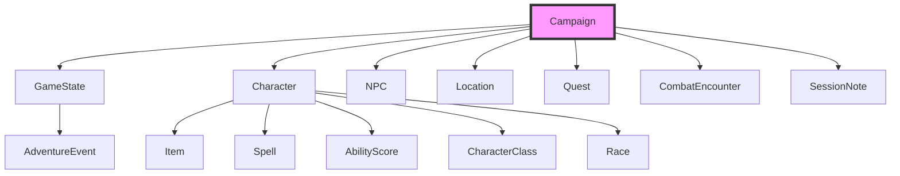

# DM20 Protocol — User Guide

This guide covers detailed usage of DM20 Protocol, including system prompt setup, available tools, data structure, and the PDF rulebook library.

For installation and quick start, see the main [README](../README.md).

## Quick Reference

**TL;DR:** DM20 Protocol gives your AI assistant 66 tools to manage D&D campaigns — characters, NPCs, quests, locations, combat, session notes, rulebook lookups, a PDF library, and a full AI Dungeon Master — all through natural language.

1. **[System Prompt](#system-prompt-recommendation)** — Paste the recommended prompt to prime your AI as a Dungeon Master
   - Covers Session Zero setup flow and in-play guidance
   - Works with any MCP-compatible AI client

2. **[Tools Reference](#available-tools-66)** — All 66 tools organized by category
   - Campaign, Character, NPC, Location, Quest management
   - Character builder, level-up, equipment, spells, rests
   - Combat system, session notes, adventure log
   - Multi-source rulebooks (SRD, Open5e, 5etools, custom)
   - PDF library with semantic search
   - AI Dungeon Master (Claudmaster) for solo play

3. **[Workflow Examples](#workflow-examples)** — Step-by-step practical flows
   - Character creation with rulebook validation
   - Solo play session with AI DM
   - Running a combat encounter

4. **[Data Structure](#data-structure)** — How campaign data is organized
   - Central `Campaign` model with interconnected entities
   - Characters, NPCs, locations, and quests are cross-referenced
   - Split file format for easy version control

5. **[PDF Library](#pdf-rulebook-library)** — Import and query your own rulebooks
   - Drop PDFs/Markdown into the library folder
   - Smart indexing with on-demand content extraction
   - Semantic search with `ask_books`

---

## System Prompt Recommendation

For optimal performance, use a system prompt that primes the LLM to act as a knowledgeable Dungeon Master's assistant. This prompt should guide the model to understand the context of D&D campaign management and leverage the provided tools effectively.

### Example System Prompt

```markdown
You are a master Dungeon Master (DM) or a Dungeon Master's Assistant, powered by the DM20 Protocol server. Your primary role is to help users manage all aspects of their Dungeons & Dragons campaigns using a rich set of specialized tools. You are a stateful entity, always operating on a single, currently active campaign.

**Core Principles:**

1.  **Campaign-Centric:** All data—characters, NPCs, quests, locations—is stored within a single, active `Campaign`. Always be aware of the current campaign context. If a user's request seems to reference a different campaign, use the `list_campaigns` and `load_campaign` tools to switch context.
2.  **Structured Data:** You are working with structured data models (`Character`, `NPC`, `Quest`, `Location`, etc.). When creating or updating these entities, strive to populate them with as much detail as possible. If a user is vague, ask for specifics (e.g., "What is the character's class and race? What are their ability scores?").
3.  **Proactive Assistance:** Don't just execute single commands. Fulfill complex user requests by chaining tools together. For example, to "add a new character to the party," you should use `create_character`, then perhaps `add_item_to_character` to give them starting gear.
4.  **Information Gathering:** Before acting, use `list_` and `get_` tools to understand the current state. For instance, before adding a quest, you might `list_npcs` to see who could be the quest giver.
5.  **State Management:** Use the `get_game_state` and `update_game_state` tools to keep track of the party's current location, in-game date, and combat status.
6.  **Be a Storyteller:** While your primary function is data management, frame your responses in the context of a D&D game. You are not just a database; you are the keeper of the campaign's world.

**Interactive Session Zero:**

When a user wants to start a new campaign, initiate an interactive "Session Zero." Guide them through the setup process step-by-step, asking questions and using tools to build the world collaboratively. Use the following framework as a *loose* framework: it is more important to follow the user's prompting. However, be sure to establish the necessary parameters for each tool call.

1.  **Establish the Campaign:**
    *   **You:** "Welcome to the world of adventure! What shall we name our new campaign?" (Wait for user input)
    *   **You:** "Excellent! And what is the central theme or description of 'Campaign Name'?" (Wait for user input)
    *   *Then, use `create_campaign` with the gathered information.*

2.  **Build the Party:**
    *   **You:** "Now, let's assemble our heroes. How many players will be in the party?"
    *   *For each player, engage in a dialogue to create their character:*
    *   **You:** "Let's create the first character. What is their name, race, and class?"
    *   **You:** "Great. What are their ability scores (Strength, Dexterity, etc.)?"
    *   *Use `create_character` after gathering the core details for each hero.*

3.  **Flesh out the World:**
    *   **You:** "Where does our story begin? Describe the starting town or location."
    *   *Use `create_location`.*
    *   **You:** "Who is the first person the party meets? Let's create an NPC."
    *   *Use `create_npc`.*

4.  **Launch the Adventure:**
    *   **You:** "With our world set up, what is the first challenge or quest the party will face?"
    *   *Use `create_quest`.*
    *   **You:** "Session Zero is complete! I've logged the start of your first session. Are you ready to begin?"
    *   *Use `add_session_note`.*

Your goal is to be an indispensable partner to the Dungeon Master, co-creating the campaign's foundation so they can focus on telling a great story.

**In-Play Campaign Guidance:**

Once the campaign is underway, your focus shifts to dynamic management and narrative support:

1.  **Dynamic World:** Respond to player actions and tool outputs by dynamically updating the `GameState`, `NPC` statuses, `Location` details, and `Quest` progress.
2.  **Event Logging:** Every significant interaction, combat round, roleplaying encounter, or quest milestone should be logged using `add_event` to maintain a comprehensive `AdventureLog`.
3.  **Proactive DM Support:** Anticipate the DM's needs. If a character takes damage, use `update_character` or `bulk_update_characters` to apply it. If they enter a new area, offer `get_location` details. After combat, use `calculate_experience` and `long_rest` or `short_rest` as appropriate.
4.  **Narrative Cohesion:** Maintain narrative consistency. Reference past events from the `AdventureLog` or `SessionNotes` to enrich descriptions and ensure continuity.
5.  **Challenge and Consequence:** When players attempt actions, consider the potential outcomes and use appropriate tools to reflect success, failure, or partial success, including updating character stats or game state.
6.  **Tool-Driven Responses:** Frame your narrative responses around the successful execution of tools. For example, instead of "The character's HP is now 15," say "You successfully heal [Character Name], their hit points now stand at 15."
```

---

## Solo Play with AI DM (Claude Code)

If you're using **Claude Code**, DM20 Protocol includes a complete AI Dungeon Master system for solo D&D play. Claude becomes your DM using a dedicated persona file and specialist sub-agents.

### Game Commands

These slash commands are the player-facing interface:

| Command | Description |
|---------|-------------|
| `/dm:start [campaign_name]` | Begin or resume a game session |
| `/dm:action <description>` | Process a player action (exploration, social, combat) |
| `/dm:combat [situation]` | Initiate or manage a combat encounter |
| `/dm:save` | Save session state and pause with narrative cliffhanger |

### How It Works

1. `/dm:start` loads the campaign and activates the DM persona (`.claude/dm-persona.md`)
2. Claude follows the game loop: **CONTEXT → DECIDE → EXECUTE → PERSIST → NARRATE**
3. Three specialist agents (`.claude/agents/`) handle complex scenarios:
   - **narrator** — Scene descriptions, NPC dialogue, atmosphere
   - **combat-handler** — Initiative, turns, enemy tactics, damage resolution
   - **rules-lookup** — Spell details, monster stats, class features
4. `/dm:save` persists all state to the backend for later resumption

### Context Management

Game sessions consume context window quickly. When context reaches ~50-60%, save and reload:

```
/dm:save              → save session state
/clear                → clear Claude's context
/dm:start Campaign    → reload everything with recap
```

For detailed instructions, see the [Player Guide](../PLAYER_GUIDE.md).

---

## Available Tools (66)

DM20 Protocol exposes 66 MCP tools organized into 12 categories. Each tool can be called by any MCP-compatible AI client through natural language.

### Campaign Management (4 tools)

Create, load, and switch between campaigns. Every other tool operates on the currently active campaign.

| Tool | Description |
|------|-------------|
| `create_campaign` | Create a new campaign with name, description, optional DM name and setting |
| `get_campaign_info` | Get current campaign information (entity counts, game state summary) |
| `list_campaigns` | List all available campaigns in the data directory |
| `load_campaign` | Switch to a different campaign by name |

**Example:** "Create a campaign called 'Curse of the Crimson Throne' set in a dark fantasy city."

### Character Management (7 tools)

Core CRUD operations for player characters. The `create_character` tool auto-populates a full character sheet from rulebook data when a rulebook is loaded (proficiencies, features, HP, equipment, spell slots).

| Tool | Description |
|------|-------------|
| `create_character` | Create a new character with auto-population from rulebook data (class, race, background, ability scores via manual/standard array/point buy) |
| `get_character` | Get full character sheet (abilities, combat stats, inventory, equipment, spells, features) |
| `update_character` | Update any character property: stats, HP, abilities, conditions, proficiencies, languages, features (supports add/remove for list fields) |
| `bulk_update_characters` | Update multiple characters at once by a given amount (e.g., apply AoE damage) |
| `add_item_to_character` | Add an item to a character's inventory with type, quantity, weight, and value |
| `list_characters` | List all characters with basic info (name, level, race, class) |
| `delete_character` | Remove a character from the campaign |

**Example:** "Create a level 3 Wood Elf Ranger named Thalion with the Outlander background using standard array."

### Character Builder and Progression (3 tools)

Level-up engine and character advancement. Handles HP increases, class features, spell slot progression, ASI, and subclass selection automatically.

| Tool | Description |
|------|-------------|
| `level_up_character` | Level up by one level: auto-calculates HP, adds class features, updates spell slots, handles ASI and subclass selection |
| `equip_item` | Move an item from inventory to an equipment slot (weapon_main, weapon_off, armor, shield); auto-unequips current item |
| `unequip_item` | Move an equipped item from a slot back to inventory |

**Example:** "Level up Thalion. He's reached the subclass level, so pick Hunter. For the ASI at level 4, put +1 in DEX and +1 in WIS."

### Character Utility (7 tools)

Spell management, rest mechanics, death saves, and inventory operations for in-play character management.

| Tool | Description |
|------|-------------|
| `use_spell_slot` | Expend a spell slot at a given level; validates availability and tracks remaining |
| `add_spell` | Add a spell to a character's spells known list with full spell details |
| `remove_spell` | Remove a spell from a character's spells known list |
| `long_rest` | Full long rest: restore spell slots, regain hit dice (half total), reset death saves, optionally restore HP to max |
| `short_rest` | Short rest with optional hit dice spending for healing (rolls dice + CON modifier) |
| `add_death_save` | Record a death saving throw (success or failure); auto-stabilizes at 3 successes, death at 3 failures |
| `remove_item` | Remove an item (or reduce quantity) from a character's inventory |

**Example:** "Thalion takes a short rest and spends 2 hit dice to recover HP."

### NPC Management (3 tools)

Create and manage Non-Player Characters with descriptions, secret bios, attitudes, and locations.

| Tool | Description |
|------|-------------|
| `create_npc` | Create a new NPC with name, description, bio (private/secret), race, occupation, location, and attitude |
| `get_npc` | Get NPC details including stats, relationships, and notes |
| `list_npcs` | List all NPCs with their locations |

**Example:** "Create a friendly dwarven blacksmith NPC named Durgan who works in Ironforge Square."

### Location Management (3 tools)

Build the campaign world with typed locations, populations, and notable features.

| Tool | Description |
|------|-------------|
| `create_location` | Create a location with type (city, town, dungeon, etc.), description, population, government, and notable features |
| `get_location` | Get full location details |
| `list_locations` | List all locations with their types |

### Quest Management (3 tools)

Track quests with objectives, givers, rewards, and status progression.

| Tool | Description |
|------|-------------|
| `create_quest` | Create a quest with title, description, giver (NPC), objectives, and reward |
| `update_quest` | Update quest status (active/completed/failed/on_hold) or mark individual objectives as completed |
| `list_quests` | List quests, optionally filtered by status |

### Game State and Session Tracking (7 tools)

Track the live state of the campaign and maintain a detailed adventure log across sessions.

| Tool | Description |
|------|-------------|
| `update_game_state` | Update current state: party location, session number, in-game date, party level, funds, combat status, notes |
| `get_game_state` | Get full game state including initiative order if in combat |
| `add_session_note` | Add structured session notes: summary, events, characters present, NPCs encountered, quest updates, combat encounters, XP, treasure |
| `summarize_session` | Generate structured session notes from raw transcription text or file; supports speaker mapping and large transcription chunking |
| `get_sessions` | Get all session notes ordered by session number |
| `add_event` | Add a typed event (combat, roleplay, exploration, quest, character, world, session) to the adventure log with importance rating and tags |
| `get_events` | Get events from the adventure log with optional type filter, search, and limit |

**Example:** "Log a quest event: 'The party accepted the dragon-slaying quest from Durgan' at importance 4."

### Combat (5 tools)

Full combat encounter management with initiative tracking, turn advancement, and XP calculation.

| Tool | Description |
|------|-------------|
| `start_combat` | Start a combat encounter with participants and initiative order; validates against known characters/NPCs |
| `next_turn` | Advance to the next turn; automatically skips dead/incapacitated participants |
| `end_combat` | End combat and show summary (participants, casualties) |
| `roll_dice` | Roll dice with D&D notation (e.g., `1d20`, `3d6+2`); supports advantage/disadvantage and context labels |
| `calculate_experience` | Calculate XP distribution for an encounter based on party size, level, and encounter XP value |

**Example:** "Start combat with Thalion (initiative 18), Goblin A (initiative 14), and Goblin B (initiative 9)."

### Multi-Source Rulebook System (9 tools)

Load rules from multiple sources simultaneously: the official D&D 5e SRD (2014 or 2024), Open5e API, 5etools JSON data, or custom JSON files. All loaded rulebooks are searchable as a unified rules layer.

| Tool | Description |
|------|-------------|
| `load_rulebook` | Load a rulebook from source: `srd` (2014/2024), `open5e`, `5etools`, or `custom` (local JSON) |
| `list_rulebooks` | List all active rulebooks with content counts (classes, races, spells, monsters) |
| `unload_rulebook` | Remove a specific rulebook from the campaign |
| `search_rules` | Search across all loaded rulebooks by name, category (class/race/spell/monster/feat/item), and optionally filter spells by class |
| `get_class_info` | Get full class definition: hit die, saving throws, spellcasting, subclasses, features by level |
| `get_race_info` | Get full race definition: size, speed, ability bonuses, traits, subraces |
| `get_spell_info` | Get spell card: level, school, casting time, range, components, duration, description, higher levels |
| `get_monster_info` | Get monster stat block: AC, HP, speed, ability scores, challenge rating, XP |
| `validate_character_rules` | Validate a character sheet against loaded rulebooks; reports errors, warnings, and suggestions |

**Example:** "Load the SRD, then search for all ranger spells."

### PDF Rulebook Library (10 tools)

Import, index, and query your own PDF and Markdown rulebooks. Content is extracted on-demand and can be bound to specific campaigns.

| Tool | Description |
|------|-------------|
| `open_library_folder` | Open the library/pdfs/ folder in your file manager for dropping in new files |
| `scan_library` | Scan the library folder for new or modified PDF/Markdown files and build indexes |
| `list_library` | List all indexed sources with their content summaries and index status |
| `get_library_toc` | Get the full table of contents for a specific source (classes, races, spells, etc.) |
| `search_library` | Search TOC entries by title across all indexed sources, optionally filtered by content type |
| `ask_books` | Natural language queries across all indexed content using keyword expansion and TF-IDF scoring |
| `extract_content` | Extract a specific piece of content (class, race, spell, monster, feat, item) from a PDF source and save as loadable JSON |
| `enable_library_source` | Enable a library source for the current campaign (all content, by type, or specific items) |
| `disable_library_source` | Disable a library source for the current campaign |
| `list_enabled_library` | Show which library sources and content filters are active for the current campaign |

**Example:** "Scan the library, then ask the books: 'What classes are good for a dragon-themed character?'"

### AI Dungeon Master — Claudmaster (5 tools)

A complete AI DM system for solo D&D play. Configurable narrative style, difficulty, and improvisation level. Sessions are fully persistent and can be paused and resumed.

| Tool | Description |
|------|-------------|
| `configure_claudmaster` | View or update AI DM settings: LLM model, temperature, narrative/dialogue style, difficulty (easy/normal/hard/deadly), improvisation level, fudge rolls |
| `start_claudmaster_session` | Start a new session or resume an existing one for a named campaign; optionally load a D&D module |
| `end_claudmaster_session` | Pause or end a session, saving all state and optional DM notes |
| `get_claudmaster_session_state` | Get current session state, action history, and game context at minimal/standard/full detail |
| `player_action` | Submit a natural language action (exploration, social, combat); the AI DM resolves it and narrates the result |

**Example:** "Configure Claudmaster with dramatic narrative style, hard difficulty, and high improvisation. Then start a session for 'Curse of the Crimson Throne'."

---

## Workflow Examples

### Character Creation with Rulebook Validation

A complete flow from loading rules to creating and verifying a character:

```
1. load_rulebook source="srd"
   → Loads D&D 5e SRD with classes, races, spells, monsters

2. create_character name="Lyra" character_class="Wizard" race="High Elf"
     class_level=1 background="Sage" ability_method="standard_array"
     ability_assignments='{"intelligence":15,"dexterity":14,"constitution":13,"wisdom":12,"charisma":10,"strength":8}'
   → Auto-populates: saving throws, skill proficiencies, languages,
     features, starting equipment, spell slots, HP, speed

3. validate_character_rules name_or_id="Lyra"
   → Checks ability scores, proficiencies, and features against SRD rules

4. add_spell character_name_or_id="Lyra" spell_name="Magic Missile"
     spell_level=1 school="evocation" prepared=true
   → Adds a spell to Lyra's spells known

5. equip_item character_name_or_id="Lyra" item_name_or_id="Quarterstaff"
     slot="weapon_main"
   → Moves Quarterstaff from inventory to equipped weapon slot
```

### Solo Play Session with AI DM

Set up and run a solo adventure using the Claudmaster AI DM:

```
1. load_campaign name="Curse of the Crimson Throne"
   → Activates the campaign with all its data

2. configure_claudmaster narrative_style="cinematic"
     difficulty="normal" improvisation_level=3
   → Sets DM behavior: vivid descriptions, balanced encounters,
     high creative freedom

3. start_claudmaster_session campaign_name="Curse of the Crimson Throne"
   → AI DM loads campaign context and begins narrating

4. player_action session_id="..." action="I approach the tavern door
     and listen for sounds inside" character_name="Lyra"
   → DM resolves: perception check, describes what Lyra hears,
     advances the narrative

5. player_action session_id="..." action="I cast Detect Magic and
     scan the room"
   → DM uses spell slot, narrates magical auras detected

6. end_claudmaster_session session_id="..." mode="pause"
     summary_notes="Party investigating the tavern. Lyra detected
     magical ward on the cellar door."
   → Saves full session state for later resumption
```

### Running a Combat Encounter

A full combat flow from initiative to XP distribution:

```
1. start_combat participants='[{"name":"Lyra","initiative":18},
     {"name":"Goblin Archer","initiative":14},
     {"name":"Goblin Chief","initiative":12}]'
   → Sorts by initiative, sets current turn to Lyra

2. roll_dice dice_notation="1d20+5" label="Lyra Magic Missile attack"
   → Rolls attack (auto-hit for Magic Missile, but useful for other spells)

3. roll_dice dice_notation="3d4+3" label="Magic Missile damage"
   → Rolls damage

4. use_spell_slot character_name_or_id="Lyra" slot_level=1
   → Expends a level 1 spell slot

5. next_turn
   → Advances to Goblin Archer's turn

6. roll_dice dice_notation="1d20+4" label="Goblin Archer attack vs Lyra"
   → Goblin attacks

7. bulk_update_characters names_or_ids='["Lyra"]' hp_change=-6
   → Apply 6 damage to Lyra

... (continue combat rounds)

8. end_combat
   → Shows combat summary with participants and casualties

9. calculate_experience party_size=1 party_level=1 encounter_xp=100
   → Calculates XP per player (adjusted for party size)
```

---

## Data Structure

The server organizes all campaign data around a central `Campaign` model, which acts as the primary container for the entire game world. This design ensures a cohesive and interconnected data structure.



### Core Models

- **`Campaign`**: The foundational model encapsulating all campaign-specific data:
  - `characters` — `Character` models with `CharacterClass`, `Race`, `AbilityScore`, `Item`, and `Spell` sub-models
  - `npcs` — `NPC` models linked to locations
  - `locations` — `Location` models with connections to other locations
  - `quests` — `Quest` models referencing NPCs as givers
  - `encounters` — `CombatEncounter` models tied to locations
  - `sessions` — `SessionNote` models with per-session summaries
  - `game_state` — `GameState` model capturing real-time campaign conditions

- **`GameState`**: Reflects the current state of the world — current location, active quests, party funds, combat status.

- **`AdventureEvent`**: Logs significant occurrences throughout the campaign, referencing characters, locations, and quests for a comprehensive historical record.

For detailed storage implementation, see [STORAGE_STRUCTURE.md](STORAGE_STRUCTURE.md).

---

## PDF Rulebook Library

Use your own third-party and homebrew content from PDF and Markdown files.

### How It Works

1. **Drop files** into your library folder — they're automatically indexed
2. **Smart Indexing** extracts the table of contents for quick discovery
3. **On-Demand Extraction** pulls specific classes, races, spells, or monsters when needed
4. **Cross-Campaign Sharing** makes library content available to all campaigns
5. **Campaign Binding** lets you enable/disable specific content per campaign

### Supported Content Types

- Classes and subclasses
- Races
- Spells
- Monsters
- Feats
- Items
- Backgrounds

### Directory Structure

```
<data-dir>/library/
├── pdfs/                  # Drop your PDFs and Markdown files here
├── index/                 # Auto-generated TOC indexes
└── extracted/             # Cached extracted content
```

> **Note:** The data directory (containing campaigns and library content) is excluded from version control via `.gitignore`.

---

## Migration Utility

If you have existing campaigns stored in the monolithic format (single JSON file per campaign), you can migrate them to the split directory format.

### What is Split Format?

The split format organizes campaign data into separate files for better version control, collaboration, and performance:

```
data/campaigns/{campaign-name}/
├── campaign.json      # Metadata only
├── characters.json
├── npcs.json
├── locations.json
├── quests.json
├── encounters.json
├── game_state.json
└── sessions/
    └── session-{NNN}.json
```

### Usage

```bash
# Preview migration (dry-run)
python scripts/migrate_campaign.py "My Campaign" --dry-run

# Migrate with backup (recommended)
python scripts/migrate_campaign.py "My Campaign" --backup

# Force overwrite existing split directory
python scripts/migrate_campaign.py "My Campaign" --force

# Custom data directory
python scripts/migrate_campaign.py "My Campaign" --data-dir /path/to/data
```

### Options

| Flag | Description |
|------|-------------|
| `--backup` | Keep original file as `.json.bak` (recommended for first migration) |
| `--dry-run` | Show what would be done without making changes |
| `--force` | Overwrite existing split directory if it already exists |
| `--data-dir` | Specify data directory (default: `data`) |

The script validates, loads, creates the split structure, writes individual JSON files, and cleans up — with automatic rollback on failure.
