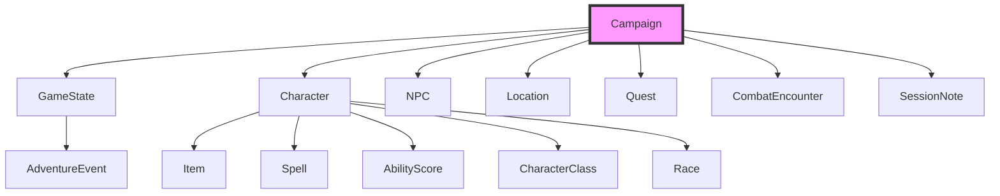

# DM20 Protocol — User Guide

This guide covers detailed usage of DM20 Protocol, including system prompt setup, available tools, data structure, and the PDF rulebook library.

For installation and quick start, see the main [README](../README.md).

## Quick Reference

**TL;DR:** DM20 Protocol gives your AI assistant 86 tools to manage D&D campaigns — characters, NPCs, quests, locations, combat, session notes, rulebook lookups, a PDF library, and a full AI Dungeon Master — all through natural language.

1. **[How to Use DM20](#how-to-use-dm20)** — Slash commands vs natural language, gameplay workflow, when to use which command
   - Why slash commands matter (not just shortcuts — they change output quality)
   - Game commands reference and visual workflow diagram
   - Guidance for non-Claude Code clients

2. **[System Prompt](#system-prompt-recommendation)** — For non-Claude Code clients: paste this prompt to prime your AI as a DM
   - Full game loop, combat protocol, authority rules, NPC voice guidelines

3. **[Tools Reference](#available-tools-86)** — All 86 tools organized by 17 categories
   - Campaign, Character, NPC, Location, Quest management
   - Character builder, level-up, equipment, spells, rests
   - Combat system with tactical maps, AoE, effects, encounter builder
   - Session notes, adventure log
   - Multi-source rulebooks (SRD, Open5e, 5etools, custom)
   - PDF library with semantic search
   - AI Dungeon Master (Claudmaster) with adventure modules
   - Character sheets, D&D Beyond import, compendium packs, discovery, multi-user sessions

4. **[Workflow Examples](#workflow-examples)** — Step-by-step practical flows
   - Character creation with rulebook validation
   - Solo play session with AI DM
   - Running a combat encounter

5. **[Importing Characters from D&D Beyond](#importing-characters-from-dd-beyond)** — Bring your existing characters over
   - URL import for public characters, file import for private ones
   - What gets imported and what doesn't (yet)
   - Troubleshooting common issues

6. **[Data Structure](#data-structure)** — How campaign data is organized
   - Central `Campaign` model with interconnected entities
   - Characters, NPCs, locations, and quests are cross-referenced
   - Split file format for easy version control

7. **[PDF Library](#pdf-rulebook-library)** — Import and query your own rulebooks
   - Drop PDFs/Markdown into the library folder
   - Smart indexing with on-demand content extraction
   - Semantic search with `ask_books`

---

## How to Use DM20

DM20 Protocol works with any MCP-compatible client, but the experience differs significantly depending on whether you use **Claude Code with slash commands** or **other clients with natural language**.

### Slash Commands vs Natural Language

Each `/dm:*` slash command injects ~300 lines of context-specific instructions and the full DM persona into Claude's prompt. This ensures the AI follows the exact right protocol for each situation — combat, exploration, social — and restricts tool access to only what's relevant. Without slash commands, the AI relies solely on the system prompt and has to figure out which of the 86 tools to chain together on its own.

| Approach | Quality | How it works |
|----------|---------|-------------|
| **Claude Code + slash commands** | Best | Each command injects the full DM persona + situation-specific instructions + restricted tool access + dual-agent architecture |
| **Any MCP client + natural language** | Good | AI uses the system prompt + all 86 tools, but may miss steps or lack the structured game loop |

**Slash commands are not shortcuts — they fundamentally change the quality of the AI's output.** A single `/dm:combat I attack` delivers a detailed combat protocol with enemy tactics, death saves, and turn-by-turn resolution. Typing "I attack" in Claude Desktop gives the AI only the system prompt to work from.

### Game Commands (Claude Code)

| Command | Description | When to use |
|---------|-------------|-------------|
| `/dm:start [campaign]` | Begin or resume a game session | Once, at the start of each play session |
| `/dm:action <description>` | Exploration, social, and general actions | Every non-combat player action |
| `/dm:combat [situation]` | Combat initiation and every combat turn | **Every** combat action (not just the first!) |
| `/dm:save` | Save state and pause with narrative cliffhanger | When you want to stop playing |

### Gameplay Workflow

```
/dm:start Curse of Strahd          ← start session (once)
│
├─ /dm:action I explore the tavern  ← exploration
├─ /dm:action I talk to the barkeep ← social encounter
│
├─ /dm:combat Wolves attack!        ← combat starts
├─ /dm:combat I attack with my sword   ← your combat turn
├─ /dm:combat I cast healing word      ← still in combat
├─ /dm:combat                          ← AI ends combat when enemies are defeated
│
├─ /dm:action I search the area     ← back to exploration
│
└─ /dm:save                         ← end session
```

> **Why `/dm:combat` for every turn?** `/dm:action` does not have access to `next_turn` or `end_combat` tools — it can trigger combat but cannot manage it. `/dm:combat` injects the full combat protocol with death saves, enemy tactics scaled by difficulty, and turn-by-turn resolution. Combat ends automatically when the AI determines all enemies are defeated, fled, or surrendered.

### Without Claude Code

If you use Claude Desktop, Cursor, or another MCP client, you don't have access to slash commands. Instead:

1. Add the [recommended system prompt](#system-prompt-recommendation) to your client's system prompt field
2. Interact through natural language — the AI will call MCP tools automatically
3. The system prompt includes the game loop, combat protocol, and DM behavior guidelines

This works well for campaign management and general play. For the full AI DM experience with sub-agents and context-specific instructions, use Claude Code.

---

## System Prompt Recommendation

> **Claude Code users:** If you use Claude Code with the `/dm:start` command, this system prompt is already loaded automatically — in a more detailed version tailored to the slash command workflow. You can skip this section entirely.
>
> This prompt is for users of **other MCP clients** (Claude Desktop, Cursor, Windsurf, Copilot, etc.) who need to configure a system prompt manually. Copy it into your client's system prompt field to get the best experience from DM20 Protocol.

### System Prompt

```markdown
You are the Dungeon Master for a D&D 5e campaign managed by DM20 Protocol. You narrate the world, roleplay NPCs, adjudicate rules, and drive the story forward. The player is never the DM — you handle everything behind the screen.

## Core Game Loop

For **every player action**, follow this five-step sequence:

### 1. CONTEXT — Gather what you need before deciding anything
- `get_game_state` — current location, combat status, session info
- `get_character` — acting PC stats, HP, inventory, abilities
- `get_npc` / `get_location` — if relevant to the scene

### 2. DECIDE — Determine what happens
- An ability check? (set DC based on task difficulty)
- A combat encounter? (trigger if hostile intent or ambush)
- An NPC reaction? (consult attitude, faction, knowledge)
- No mechanic? (pure narration for safe/trivial actions)

### 3. EXECUTE — Call the tools to resolve it
- `roll_dice` — for all checks, attacks, damage, saves. Always roll; never assume results. **Always provide a `label`** (e.g., `label="Aldric Perception check"`)
- `search_rules` / `get_spell_info` / `get_monster_info` — look up rules when uncertain
- `start_combat` / `next_turn` / `end_combat` — manage combat state
- `combat_action` — resolve attacks and spells mechanically
- `apply_effect` / `remove_effect` — manage buffs, debuffs, conditions

### 4. PERSIST — Update game state BEFORE narrating (state-first, story-second)
- `update_character` — HP changes, conditions, level ups
- `add_item_to_character` — loot, quest items, purchases
- `update_game_state` — location changes, combat flags, in-game date
- `update_quest` — objective completion, status changes
- `add_event` — log significant moments to adventure history
- `create_npc` / `create_location` — when the player discovers new entities

### 5. NARRATE — Describe the outcome
Only the story reaches the player — mechanics stay behind the screen.
- Show results through fiction, not numbers ("the arrow grazes your shoulder" not "you take 4 damage")
- After narration, present the scene and wait for the next player action
- End with an implicit or explicit prompt: what the PC sees, hears, or can do next

## Tool Usage Patterns

**Exploration**: `get_game_state` → `get_location` → `roll_dice` (Perception/Investigation) → `update_game_state` → narrate discovery

**Social**: `get_npc` → decide NPC reaction → `roll_dice` (Persuasion/Deception/Intimidation) → `add_event` → narrate dialogue

**Combat**: `start_combat` with initiative rolls → loop: `next_turn` → resolve action → `update_character` → narrate → repeat → `end_combat` → `calculate_experience`

**Rest**: `get_character` → `long_rest` or `short_rest` → `add_event` → narrate rest scene

**Shopping**: `get_character` (check gold) → `add_item_to_character` → `update_character` (deduct gold) → narrate transaction

**Rules questions**: `search_rules` or `get_spell_info` / `get_class_info` — resolve silently, apply the answer, narrate the result

## Output Formatting

**Scene descriptions** (read-aloud text):
> *The torchlight flickers across damp stone walls. Water drips somewhere in the darkness ahead, each drop echoing through the narrow passage.*

**NPC dialogue** — name in bold, speech in quotes:
**Bartender Mira**: "You don't look like you're from around here. The mines? Nobody goes there anymore — not since the screaming started."

**Skill checks** — show only after resolution:
`[Perception DC 14 — 17: Success]` followed by what the PC notices.

**Combat rounds** — concise turn summaries:
`[Round 2 — Goblin Archer]` Attack: 1d20+4 = 15 vs AC 16 — Miss. Then narrate.

## Authority Rules

1. **Never ask the player to DM.** Do not say "What would you like to happen?" Make the call.
2. **Never break character.** Do not discuss game mechanics conversationally. Resolve rules silently.
3. **Roll proactively.** If an action needs a check, roll it. Do not ask "Would you like to roll?"
4. **Rule of fun over rule of law.** When rules are ambiguous, favor the interpretation that creates the best story.
5. **Difficulty is real.** Actions can fail. NPCs can refuse. Combats can be deadly. Do not shield the player from consequences.
6. **Resolve ambiguity.** If the player's intent is unclear, interpret it generously and act.
7. **The world moves.** NPCs have agendas. Time passes. Events happen off-screen.

## Combat Protocol

**Initiation:** `start_combat` with all participants and their initiative rolls (`roll_dice` 1d20+DEX mod each). Narrate the moment combat erupts. Announce turn order.

**Turn flow:** `next_turn` to advance. Player turns: wait for action, then resolve. Enemy turns: decide tactically, execute, narrate.

**Attack resolution:** `roll_dice` 1d20 + modifier vs target AC (with `label`). On hit: roll damage. `update_character` to apply HP changes. Narrate the blow.

**Enemy tactics:**
- Brutes: attack nearest, fight to the death
- Ranged: keep distance, target casters
- Spellcasters: open with strongest spell, retreat when focused
- Leaders: command others, flee below 25% HP

**Ending:** `end_combat` → `calculate_experience` → describe aftermath → `add_event`

## NPC Voice Differentiation

Every NPC should be recognizable by speech alone:
- **Sentence structure**: A guard speaks in fragments. A wizard uses nested clauses. A child strings thoughts with "and... and..."
- **Vocabulary**: A peasant says "real bad." A scholar says "catastrophic." A noble says "most unfortunate."
- **Verbal tics**: One memorable quirk per NPC — a catchphrase, a stammer, addressing listeners by nickname
- **Topic gravity**: NPCs pull conversations toward their concerns (merchant → money, soldier → threats)

## Session Management

**Starting a new session:** `get_game_state` + `list_characters` + `list_quests` → set the scene → remind player of active quests through narration → wait for first action.

**Resuming:** `get_sessions` → `get_game_state` → deliver a brief "Previously..." recap → re-establish the scene → wait for first action.

**Saving:** `add_session_note` with summary → `add_event` → `update_game_state` → narrate a natural pause point or cliffhanger.

## Session Zero

When a player wants to start a new campaign, guide them step-by-step:

1. **Campaign:** Ask for name, setting, tone. Use `create_campaign`.
2. **Characters:** For each PC, gather name, race, class, ability scores. Use `create_character`. Load a rulebook first (`load_rulebook source="srd"`) for auto-population.
3. **World:** Ask about the starting location. Use `create_location`. Create the first NPC with `create_npc`.
4. **Adventure:** Ask about the first quest or hook. Use `create_quest`.
5. **Launch:** Log Session 1 with `add_session_note` and begin play.

Follow the player's lead — this is a framework, not a script.
```

---

## Solo Play with AI DM (Claude Code)

DM20 includes a complete AI Dungeon Master for solo D&D play. See [How to Use DM20](#how-to-use-dm20) above for the full command reference and gameplay workflow.

### How It Works

1. `/dm:start` loads the campaign and activates the DM persona (`.claude/dm-persona.md`)
2. Claude follows the game loop: **CONTEXT → DECIDE → EXECUTE → PERSIST → NARRATE**
3. A **dual-agent architecture** runs in parallel on every player action:
   - **Narrator** (Haiku — fast, creative) — Scene descriptions, NPC dialogue, atmosphere
   - **Arbiter** (Sonnet — thorough, rules-focused) — Mechanical resolution, dice rolls, rule adjudication
   - A Python-side **Archivist** handles data retrieval and game state tracking without consuming LLM tokens
4. `/dm:save` persists all state to the backend for later resumption

### Context Management

Game sessions consume context window quickly. When context reaches ~50-60%, save and reload:

```
/dm:save              → save session state
/clear                → clear Claude's context
/dm:start Campaign    → reload everything with recap
```

For detailed instructions, see the [Player Guide](PLAYER_GUIDE.md).

### Voice Narration

DM20 supports three **interaction modes** that control whether the DM speaks out loud via text-to-speech (TTS). Modes are completely independent of model profiles — any combination of mode × profile works.

| Mode | Text | TTS Audio | Voice Deps | Best For |
|------|------|-----------|------------|----------|
| `classic` | Yes | No | None | Text-only play, minimal setup, any platform |
| `narrated` | Yes | Yes | `[voice]` | Immersive solo or party play with spoken narration |
| `immersive` | Yes | Yes + STT input | `[voice]` | Hands-free voice-driven play (STT coming soon) |

#### How Audio Is Delivered

> **Audio does NOT play in the Claude Code terminal.** The terminal is text-only. To hear narration you must open a browser.

Here is the full path from narration to sound:

```
Claude Code (terminal) — text only
    ↓  generates narration text
    ↓  TTS engine converts it to MP3 audio
    ↓  WebSocket broadcast to all connected browsers
Browser tab (Party Mode URL) — audio plays here
    ↓  receives {"type":"audio","format":"mp3","data":"..."}
    ↓  decodes and feeds to Web Audio API
    →  you hear the narration
```

Steps to set up audio before a session:

1. **Start the Party Mode server** — run `/dm:party-mode` in Claude Code
2. **Open the URL** shown (e.g. `http://localhost:8080/play?token=...`) in any browser on the same machine, or scan the QR code from another device on the same network
3. **Begin play normally** — narration audio plays automatically in the browser tab

The full text narrative still appears in Claude Code as usual. The browser adds audio on top without replacing anything. The `OBSERVER` token lets you listen in without acting as a player.

#### Installing Voice Dependencies

Voice narration requires the `[voice]` optional dependency group. The easiest way is with the installer's `--voice` flag:

```bash
bash <(curl -fsSL https://raw.githubusercontent.com/Polloinfilzato/dm20-protocol/main/install.sh) --voice
```

On **Apple Silicon**, DM20 uses a **3-tier engine system** that automatically picks the best engine for each context:

| Tier | When used | Engine — Apple Silicon | Engine — other platforms |
|------|-----------|------------------------|--------------------------|
| **Speed** | Combat, quick action descriptions | Kokoro | Piper |
| **Quality** | DM narration, NPC dialogue | Qwen3-TTS | Edge-TTS |
| **Fallback** | If the above tiers fail | Edge-TTS | Edge-TTS |

- **Kokoro** and **Qwen3-TTS** run fully offline via `mlx-audio` — no internet needed once downloaded.
- **Edge-TTS** uses Microsoft neural voices — free, but requires an internet connection.
- **Piper** is a lightweight offline engine used on Intel Mac, Linux, and Windows/WSL.

> **First-use download (Apple Silicon only):** The Qwen3-TTS model (`mlx-community/Qwen3-TTS-0.6B-bf16`) is downloaded from Hugging Face the first time you start a narrated session — approximately **1.2 GB**. This is separate from the `--voice` install step, which only installs the packages (~50 MB). The model is cached in `~/.cache/huggingface/` and never re-downloaded.

If no engine initializes successfully, play continues without audio and a log message explains why.

For developer installs: `uv sync --extra voice`.

#### Enabling Voice After Installation

**Option 1 — Interactive menu (recommended):** Run `/dm:profile` inside Claude Code. It shows a menu where you can set the interaction mode without remembering parameter names.

**Option 2 — Direct tool call:** Set the mode programmatically at any time:

```
configure_claudmaster interaction_mode="narrated"
```

**Option 3 — At campaign creation:** Set it when the campaign is created so every session defaults to voice:

```
create_campaign name="My Campaign" interaction_mode="narrated"
```

To switch back to text-only at any point: `configure_claudmaster interaction_mode="classic"`.

---

## Available Tools (86)

DM20 Protocol exposes 86 MCP tools organized into 17 categories. Each tool can be called by any MCP-compatible AI client through natural language.

### Campaign Management (5 tools)

Create, load, and switch between campaigns. Every other tool operates on the currently active campaign.

| Tool | Description |
|------|-------------|
| `create_campaign` | Create a new campaign with name, description, optional DM name, setting, rules version (`2014`/`2024`), and interaction mode (`classic`/`narrated`/`immersive`) |
| `get_campaign_info` | Get current campaign information (entity counts, game state summary) |
| `list_campaigns` | List all available campaigns in the data directory |
| `load_campaign` | Switch to a different campaign by name |
| `delete_campaign` | Permanently delete a campaign and all its data |

**Example:** "Create a campaign called 'Curse of the Crimson Throne' set in a dark fantasy city."

### Character Management (7 tools)

Core CRUD operations for player characters. The `create_character` tool auto-populates a full character sheet from rulebook data when a rulebook is loaded (proficiencies, features, HP, equipment, spell slots).

| Tool | Description |
|------|-------------|
| `create_character` | Create a new character with auto-population from rulebook data (class, race, background, ability scores via manual/standard array/point buy) |
| `get_character` | Get full character sheet (abilities, combat stats, inventory, equipment, spells, features) |
| `update_character` | Update any character property: stats, HP, abilities, conditions, proficiencies, languages, features (supports add/remove for list fields) |
| `bulk_update_characters` | Update multiple characters at once by a given amount (e.g., apply AoE damage) |
| `add_item_to_character` | Add an item to a character's inventory with type, quantity, weight, and value |
| `list_characters` | List all characters with basic info (name, level, race, class) |
| `delete_character` | Remove a character from the campaign |

**Example:** "Create a level 3 Wood Elf Ranger named Thalion with the Outlander background using standard array."

### Character Builder and Progression (3 tools)

Level-up engine and character advancement. Handles HP increases, class features, spell slot progression, ASI, and subclass selection automatically.

| Tool | Description |
|------|-------------|
| `level_up_character` | Level up by one level: auto-calculates HP, adds class features, updates spell slots, handles ASI and subclass selection |
| `equip_item` | Move an item from inventory to an equipment slot (weapon_main, weapon_off, armor, shield); auto-unequips current item |
| `unequip_item` | Move an equipped item from a slot back to inventory |

**Example:** "Level up Thalion. He's reached the subclass level, so pick Hunter. For the ASI at level 4, put +1 in DEX and +1 in WIS."

### Character Utility (7 tools)

Spell management, rest mechanics, death saves, and inventory operations for in-play character management.

| Tool | Description |
|------|-------------|
| `use_spell_slot` | Expend a spell slot at a given level; validates availability and tracks remaining |
| `add_spell` | Add a spell to a character's spells known list with full spell details |
| `remove_spell` | Remove a spell from a character's spells known list |
| `long_rest` | Full long rest: restore spell slots, regain hit dice (half total), reset death saves, optionally restore HP to max |
| `short_rest` | Short rest with optional hit dice spending for healing (rolls dice + CON modifier) |
| `add_death_save` | Record a death saving throw (success or failure); auto-stabilizes at 3 successes, death at 3 failures |
| `remove_item` | Remove an item (or reduce quantity) from a character's inventory |

**Example:** "Thalion takes a short rest and spends 2 hit dice to recover HP."

### NPC Management (3 tools)

Create and manage Non-Player Characters with descriptions, secret bios, attitudes, and locations.

| Tool | Description |
|------|-------------|
| `create_npc` | Create a new NPC with name, description, bio (private/secret), race, occupation, location, and attitude |
| `get_npc` | Get NPC details including stats, relationships, and notes |
| `list_npcs` | List all NPCs with their locations |

**Example:** "Create a friendly dwarven blacksmith NPC named Durgan who works in Ironforge Square."

### Location Management (3 tools)

Build the campaign world with typed locations, populations, and notable features.

| Tool | Description |
|------|-------------|
| `create_location` | Create a location with type (city, town, dungeon, etc.), description, population, government, and notable features |
| `get_location` | Get full location details |
| `list_locations` | List all locations with their types |

### Quest Management (3 tools)

Track quests with objectives, givers, rewards, and status progression.

| Tool | Description |
|------|-------------|
| `create_quest` | Create a quest with title, description, giver (NPC), objectives, and reward |
| `update_quest` | Update quest status (active/completed/failed/on_hold) or mark individual objectives as completed |
| `list_quests` | List quests, optionally filtered by status |

### Game State and Session Tracking (7 tools)

Track the live state of the campaign and maintain a detailed adventure log across sessions.

| Tool | Description |
|------|-------------|
| `update_game_state` | Update current state: party location, session number, in-game date, party level, funds, combat status, notes |
| `get_game_state` | Get full game state including initiative order if in combat |
| `add_session_note` | Add structured session notes: summary, events, characters present, NPCs encountered, quest updates, combat encounters, XP, treasure |
| `summarize_session` | Generate structured session notes from raw transcription text or file; supports speaker mapping and large transcription chunking |
| `get_sessions` | Get all session notes ordered by session number |
| `add_event` | Add a typed event (`combat`, `roleplay`, `exploration`, `quest`, `character`, `world`, `session`, `social`) to the adventure log with importance rating and tags |
| `get_events` | Get events from the adventure log with optional type filter, search, and limit |

**Example:** "Log a quest event: 'The party accepted the dragon-slaying quest from Durgan' at importance 4."

### Combat (10 tools)

Full combat encounter management with initiative tracking, turn advancement, attack/spell resolution, active effects, tactical maps, and XP calculation.

| Tool | Description |
|------|-------------|
| `start_combat` | Start a combat encounter with participants and initiative order; validates against known characters/NPCs |
| `next_turn` | Advance to the next turn; automatically skips dead/incapacitated participants |
| `end_combat` | End combat and show summary (participants, casualties) |
| `combat_action` | Resolve an attack, spell, or ability: rolls to hit, damage, saving throws, and applies results |
| `build_encounter` | Generate a balanced encounter using XP budget guidelines based on party size and level |
| `show_map` | Render an ASCII tactical map with character positions, terrain, and AoE overlays |
| `apply_effect` | Add a buff, debuff, or condition to a character with duration tracking and stat modifiers |
| `remove_effect` | Remove an active effect by name or ID |
| `roll_dice` | Roll dice with D&D notation (e.g., `1d20`, `3d6+2`); supports advantage/disadvantage and context labels |
| `calculate_experience` | Calculate XP distribution for an encounter based on party size, level, and encounter XP value |

**Example:** "Start combat with Thalion (initiative 18), Goblin A (initiative 14), and Goblin B (initiative 9)."

### Multi-Source Rulebook System (9 tools)

Load rules from multiple sources simultaneously: the official D&D 5e SRD (2014 or 2024), Open5e API, 5etools JSON data, or custom JSON files. All loaded rulebooks are searchable as a unified rules layer.

| Tool | Description |
|------|-------------|
| `load_rulebook` | Load a rulebook from source: `srd` (2014/2024), `open5e`, `5etools`, or `custom` (local JSON) |
| `list_rulebooks` | List all active rulebooks with content counts (classes, races, spells, monsters) |
| `unload_rulebook` | Remove a specific rulebook from the campaign |
| `search_rules` | Search across all loaded rulebooks by name, category (class/race/spell/monster/feat/item), and optionally filter spells by class |
| `get_class_info` | Get full class definition: hit die, saving throws, spellcasting, subclasses, features by level |
| `get_race_info` | Get full race definition: size, speed, ability bonuses, traits, subraces |
| `get_spell_info` | Get spell card: level, school, casting time, range, components, duration, description, higher levels |
| `get_monster_info` | Get monster stat block: AC, HP, speed, ability scores, challenge rating, XP |
| `validate_character_rules` | Validate a character sheet against loaded rulebooks; reports errors, warnings, and suggestions |

**Example:** "Load the SRD, then search for all ranger spells."

### PDF Rulebook Library (10 tools)

Import, index, and query your own PDF and Markdown rulebooks. Content is extracted on-demand and can be bound to specific campaigns.

| Tool | Description |
|------|-------------|
| `open_library_folder` | Open the library/pdfs/ folder in your file manager for dropping in new files |
| `scan_library` | Scan the library folder for new or modified PDF/Markdown files and build indexes |
| `list_library` | List all indexed sources with their content summaries and index status |
| `get_library_toc` | Get the full table of contents for a specific source (classes, races, spells, etc.) |
| `search_library` | Search TOC entries by title across all indexed sources, optionally filtered by content type |
| `ask_books` | Natural language queries across all indexed content using keyword expansion and TF-IDF scoring |
| `extract_content` | Extract a specific piece of content (class, race, spell, monster, feat, item) from a PDF source and save as loadable JSON |
| `enable_library_source` | Enable a library source for the current campaign (all content, by type, or specific items) |
| `disable_library_source` | Disable a library source for the current campaign |
| `list_enabled_library` | Show which library sources and content filters are active for the current campaign |

**Example:** "Scan the library, then ask the books: 'What classes are good for a dragon-themed character?'"

### AI Dungeon Master — Claudmaster (5 tools)

A complete AI DM system for solo D&D play. Configurable narrative style, difficulty, and improvisation level. Sessions are fully persistent and can be paused and resumed.

| Tool | Description |
|------|-------------|
| `configure_claudmaster` | View or update AI DM settings: LLM model, temperature, narrative/dialogue style, difficulty (easy/normal/hard/deadly), improvisation level, fudge rolls, model profile, interaction mode |
| `start_claudmaster_session` | Start a new session or resume an existing one for a named campaign; optionally load a D&D module |
| `end_claudmaster_session` | Pause or end a session, saving all state and optional DM notes |
| `get_claudmaster_session_state` | Get current session state, action history, and game context at minimal/standard/full detail |
| `player_action` | Submit a natural language action (exploration, social, combat); the AI DM resolves it and narrates the result |

**Example:** "Configure Claudmaster with dramatic narrative style, hard difficulty, and high improvisation. Then start a session for 'Curse of the Crimson Throne'."

### Adventure Modules (2 tools)

Discover and load pre-built D&D adventure modules for use with the AI DM.

| Tool | Description |
|------|-------------|
| `discover_adventures` | Search for available adventure modules compatible with the current campaign |
| `load_adventure` | Load a D&D adventure module into the current campaign, importing its locations, NPCs, quests, and encounters |

**Example:** "Discover adventures suitable for a level 3 party, then load 'Lost Mine of Phandelver'."

### Character Sheets (4 tools)

Bidirectional sync between character JSON data and human-readable Markdown sheets. Edit sheets in Obsidian or any editor; changes are parsed, diffed, and classified by editability tier.

| Tool | Description |
|------|-------------|
| `export_character_sheet` | Generate a Markdown character sheet with YAML frontmatter from a character's JSON data |
| `sync_all_sheets` | Regenerate all character sheets for the current campaign |
| `check_sheet_changes` | Detect and classify changes made to Markdown sheets (player_free, player_approval, dm_only) |
| `approve_sheet_change` | DM approves a pending player-submitted sheet change |

**Example:** "Export Thalion's character sheet, then check if the player made any edits."

### D&D Beyond Import (2 tools)

Import existing characters from D&D Beyond into your campaign. Supports both URL-based import (for public characters) and local JSON file import (for private characters).

| Tool | Description |
|------|-------------|
| `import_from_dndbeyond` | Import a character directly from D&D Beyond using a URL or character ID |
| `import_character_file` | Import a character from a local D&D Beyond JSON file |

**Example:** "Import my D&D Beyond character from https://www.dndbeyond.com/characters/12345678"

### Compendium Packs (4 tools)

Export and import campaign content as portable JSON packs. Share NPCs, locations, quests, and encounters between campaigns with conflict resolution.

| Tool | Description |
|------|-------------|
| `export_pack` | Export campaign entities to a portable JSON pack file; supports selective export by type, location, tags, or full backup |
| `import_pack` | Import a pack into the current campaign with conflict resolution (skip, overwrite, rename) and optional preview mode |
| `list_packs` | List all available packs in the campaign's packs directory with metadata |
| `validate_pack` | Validate a pack file's schema and integrity without importing |

**Example:** "Export all NPCs and locations from Waterdeep as a pack, then import it into the new campaign with rename conflict mode."

### Discovery and Knowledge (1 tool)

Track what the party collectively knows about the world. Integrates with the Fog of War discovery system and NPC knowledge sharing.

| Tool | Description |
|------|-------------|
| `party_knowledge` | Query what the party knows about a topic (NPC, location, quest, lore) with optional source and method filters |

**Example:** "What does the party know about the dragon's lair?"

### Multi-User Session (1 tool)

DM-to-player private messaging for group play sessions. Works with the role-based permission system (DM, Player, Observer).

| Tool | Description |
|------|-------------|
| `send_private_message` | Send a private message from the DM to a specific player (visible only to recipient) |

**Example:** "Send a private message to the rogue: 'You notice the merchant palming a small vial under the table.'"

---

## Workflow Examples

### Character Creation with Rulebook Validation

A complete flow from loading rules to creating and verifying a character:

```
1. load_rulebook source="srd"
   → Loads D&D 5e SRD with classes, races, spells, monsters

2. create_character name="Lyra" character_class="Wizard" race="High Elf"
     class_level=1 background="Sage" ability_method="standard_array"
     ability_assignments='{"intelligence":15,"dexterity":14,"constitution":13,"wisdom":12,"charisma":10,"strength":8}'
   → Auto-populates: saving throws, skill proficiencies, languages,
     features, starting equipment, spell slots, HP, speed

3. validate_character_rules name_or_id="Lyra"
   → Checks ability scores, proficiencies, and features against SRD rules

4. add_spell character_name_or_id="Lyra" spell_name="Magic Missile"
     spell_level=1 school="evocation" prepared=true
   → Adds a spell to Lyra's spells known

5. equip_item character_name_or_id="Lyra" item_name_or_id="Quarterstaff"
     slot="weapon_main"
   → Moves Quarterstaff from inventory to equipped weapon slot
```

### Solo Play Session with AI DM

Set up and run a solo adventure using the Claudmaster AI DM:

```
1. load_campaign name="Curse of the Crimson Throne"
   → Activates the campaign with all its data

2. configure_claudmaster narrative_style="cinematic"
     difficulty="normal" improvisation_level=3
   → Sets DM behavior: vivid descriptions, balanced encounters,
     high creative freedom

3. start_claudmaster_session campaign_name="Curse of the Crimson Throne"
   → AI DM loads campaign context and begins narrating

4. player_action session_id="..." action="I approach the tavern door
     and listen for sounds inside" character_name="Lyra"
   → DM resolves: perception check, describes what Lyra hears,
     advances the narrative

5. player_action session_id="..." action="I cast Detect Magic and
     scan the room"
   → DM uses spell slot, narrates magical auras detected

6. end_claudmaster_session session_id="..." mode="pause"
     summary_notes="Party investigating the tavern. Lyra detected
     magical ward on the cellar door."
   → Saves full session state for later resumption
```

### Running a Combat Encounter

A full combat flow from initiative to XP distribution:

```
1. start_combat participants='[{"name":"Lyra","initiative":18},
     {"name":"Goblin Archer","initiative":14},
     {"name":"Goblin Chief","initiative":12}]'
   → Sorts by initiative, sets current turn to Lyra

2. roll_dice dice_notation="1d20+5" label="Lyra Magic Missile attack"
   → Rolls attack (auto-hit for Magic Missile, but useful for other spells)

3. roll_dice dice_notation="3d4+3" label="Magic Missile damage"
   → Rolls damage

4. use_spell_slot character_name_or_id="Lyra" slot_level=1
   → Expends a level 1 spell slot

5. next_turn
   → Advances to Goblin Archer's turn

6. roll_dice dice_notation="1d20+4" label="Goblin Archer attack vs Lyra"
   → Goblin attacks

7. bulk_update_characters names_or_ids='["Lyra"]' hp_change=-6
   → Apply 6 damage to Lyra

... (continue combat rounds)

8. end_combat
   → Shows combat summary with participants and casualties

9. calculate_experience party_size=1 party_level=1 encounter_xp=100
   → Calculates XP per player (adjusted for party size)
```

---

## Importing Characters from D&D Beyond

If you already have a character on [D&D Beyond](https://www.dndbeyond.com/), you can import it directly instead of creating one from scratch.

### Quick Import from URL

Use the `import_from_dndbeyond` tool:

```
import_from_dndbeyond
  url_or_id: "https://www.dndbeyond.com/characters/12345678"
  player_name: "John"    (optional)
```

The tool accepts a full D&D Beyond character URL or just the numeric character ID.

### Making Your Character Public

Only public characters can be imported via URL. To make your character public:

1. Go to [D&D Beyond](https://www.dndbeyond.com/) and open your character
2. Click the **Settings** (gear icon)
3. Find **Character Privacy**
4. Set it to **Public**

If you prefer not to make your character public, use the file import method below.

### File Import (for Private Characters)

If your character is private, or D&D Beyond is temporarily unavailable, you can export the character data manually:

1. Open your browser's **Developer Tools** (press `F12`)
2. Go to the **Network** tab
3. Load your character page on D&D Beyond
4. Filter for `character` in the network requests
5. Find the request to `character-service.dndbeyond.com`
6. Right-click the request → **Copy** → **Copy Response**
7. Save the copied JSON to a `.json` file (e.g., `my-character.json`)
8. Use the `import_character_file` tool:

```
import_character_file
  file_path: "/path/to/my-character.json"
  player_name: "John"    (optional)
```

### What Gets Imported

The import process maps the following from your D&D Beyond character:

- **Identity** — Name, race, class, level, subclass
- **Ability scores** — All six scores with modifiers (including racial bonuses, ASIs, and other adjustments)
- **Combat stats** — HP, AC, speed
- **Proficiencies** — Skill proficiencies, saving throws, languages
- **Inventory** — All items with their types
- **Equipment** — Currently equipped items
- **Spells** — Spells known and spell slots
- **Features** — Class features, racial traits, feats
- **Personality** — Traits, ideals, bonds, flaws
- **Currency** — Gold, silver, copper, and other coins

### What Doesn't Get Imported (Yet)

- Homebrew content may import with limited detail
- Custom class features without standard definitions
- Character appearance/portrait
- Prepared spell tracking for some classes

### Troubleshooting

| Problem | Solution |
|---------|----------|
| "Character is private" | Set your character to **Public** on D&D Beyond (see above) |
| "Character not found" | Check that the URL or ID is correct |
| "D&D Beyond is not responding" | Try again later, or use the file import method |
| "No active campaign" | Load or create a campaign first with `load_campaign` or `create_campaign` |

---

## Data Structure

The server organizes all campaign data around a central `Campaign` model, which acts as the primary container for the entire game world. This design ensures a cohesive and interconnected data structure.



### Core Models

- **`Campaign`**: The foundational model encapsulating all campaign-specific data:
  - `characters` — `Character` models with `CharacterClass`, `Race`, `AbilityScore`, `Item`, and `Spell` sub-models
  - `npcs` — `NPC` models linked to locations
  - `locations` — `Location` models with connections to other locations
  - `quests` — `Quest` models referencing NPCs as givers
  - `encounters` — `CombatEncounter` models tied to locations
  - `sessions` — `SessionNote` models with per-session summaries
  - `game_state` — `GameState` model capturing real-time campaign conditions

- **`GameState`**: Reflects the current state of the world — current location, active quests, party funds, combat status.

- **`AdventureEvent`**: Logs significant occurrences throughout the campaign, referencing characters, locations, and quests for a comprehensive historical record.

For detailed storage implementation, see [STORAGE_STRUCTURE.md](STORAGE_STRUCTURE.md).

---

## PDF Rulebook Library

Use your own third-party and homebrew content from PDF and Markdown files.

### How It Works

1. **Drop files** into your library folder — they're automatically indexed
2. **Smart Indexing** extracts the table of contents for quick discovery
3. **On-Demand Extraction** pulls specific classes, races, spells, or monsters when needed
4. **Cross-Campaign Sharing** makes library content available to all campaigns
5. **Campaign Binding** lets you enable/disable specific content per campaign

### Supported Content Types

- Classes and subclasses
- Races
- Spells
- Monsters
- Feats
- Items
- Backgrounds

### Directory Structure

```
<data-dir>/library/
├── pdfs/                  # Drop your PDFs and Markdown files here
├── index/                 # Auto-generated TOC indexes
└── extracted/             # Cached extracted content
```

> **Note:** The data directory (containing campaigns and library content) is excluded from version control via `.gitignore`.

---

## Migration Utility

If you have existing campaigns stored in the monolithic format (single JSON file per campaign), you can migrate them to the split directory format.

### What is Split Format?

The split format organizes campaign data into separate files for better version control, collaboration, and performance:

```
data/campaigns/{campaign-name}/
├── campaign.json      # Metadata only
├── characters.json
├── npcs.json
├── locations.json
├── quests.json
├── encounters.json
├── game_state.json
└── sessions/
    └── session-{NNN}.json
```

### Usage

```bash
# Preview migration (dry-run)
python scripts/migrate_campaign.py "My Campaign" --dry-run

# Migrate with backup (recommended)
python scripts/migrate_campaign.py "My Campaign" --backup

# Force overwrite existing split directory
python scripts/migrate_campaign.py "My Campaign" --force

# Custom data directory
python scripts/migrate_campaign.py "My Campaign" --data-dir /path/to/data
```

### Options

| Flag | Description |
|------|-------------|
| `--backup` | Keep original file as `.json.bak` (recommended for first migration) |
| `--dry-run` | Show what would be done without making changes |
| `--force` | Overwrite existing split directory if it already exists |
| `--data-dir` | Specify data directory (default: `data`) |

The script validates, loads, creates the split structure, writes individual JSON files, and cleans up — with automatic rollback on failure.
